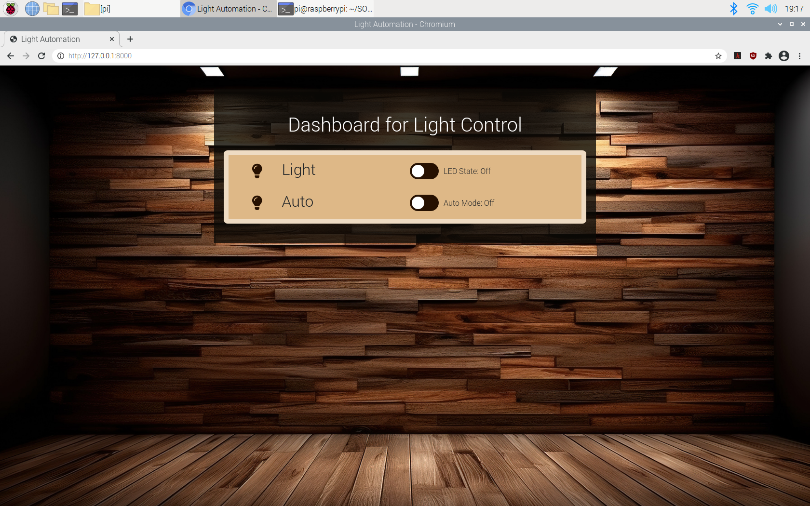
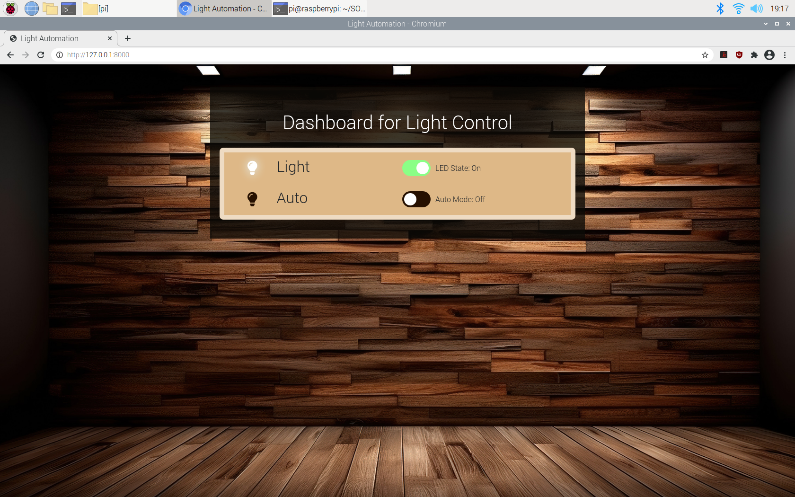
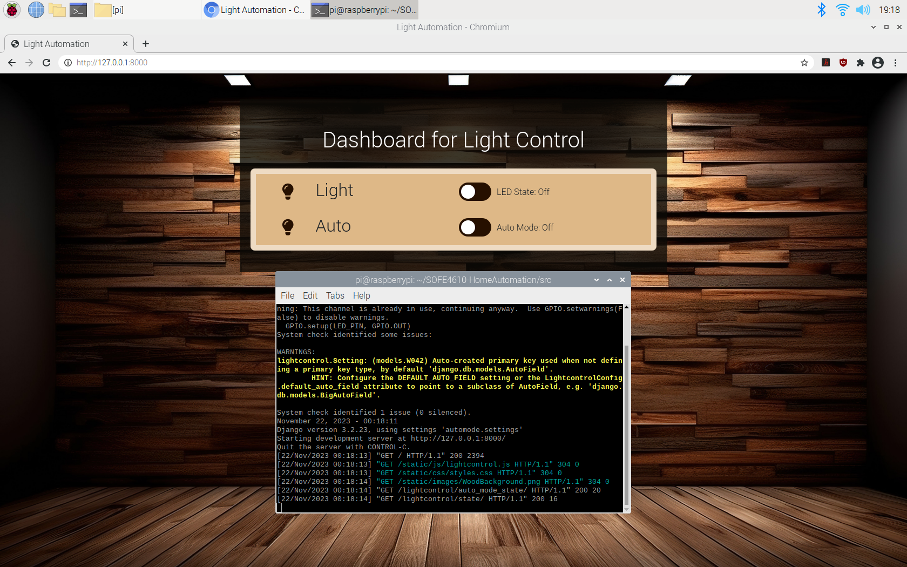
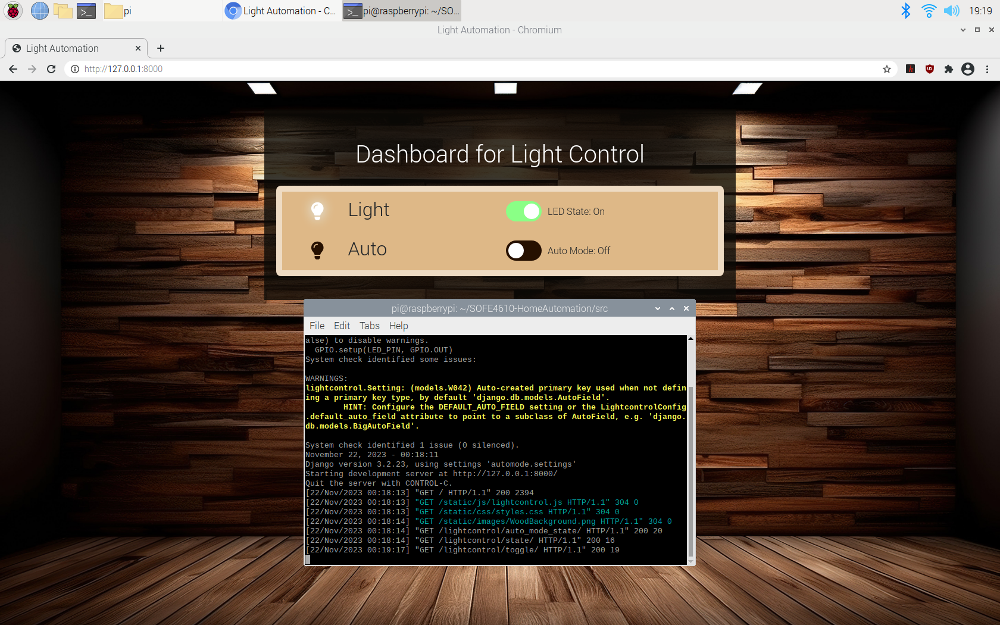
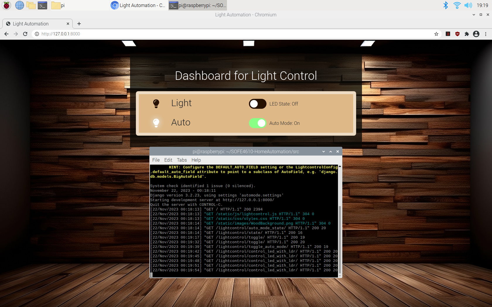
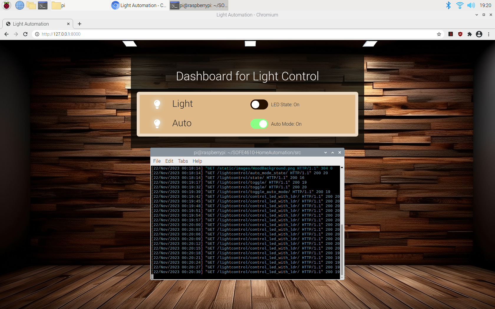
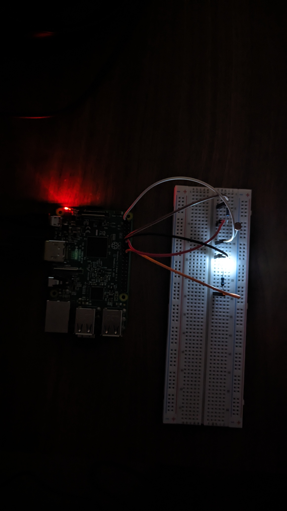
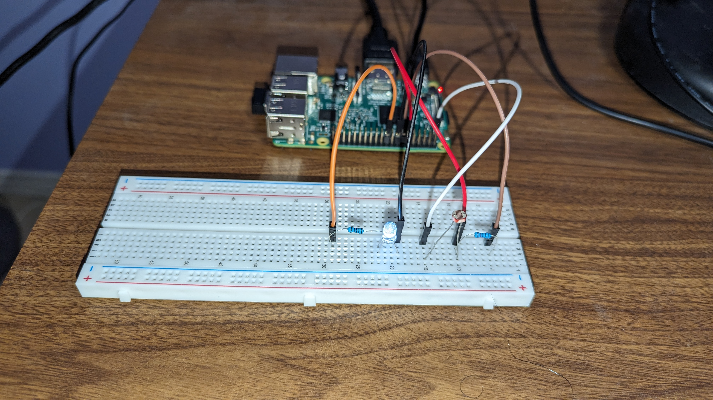
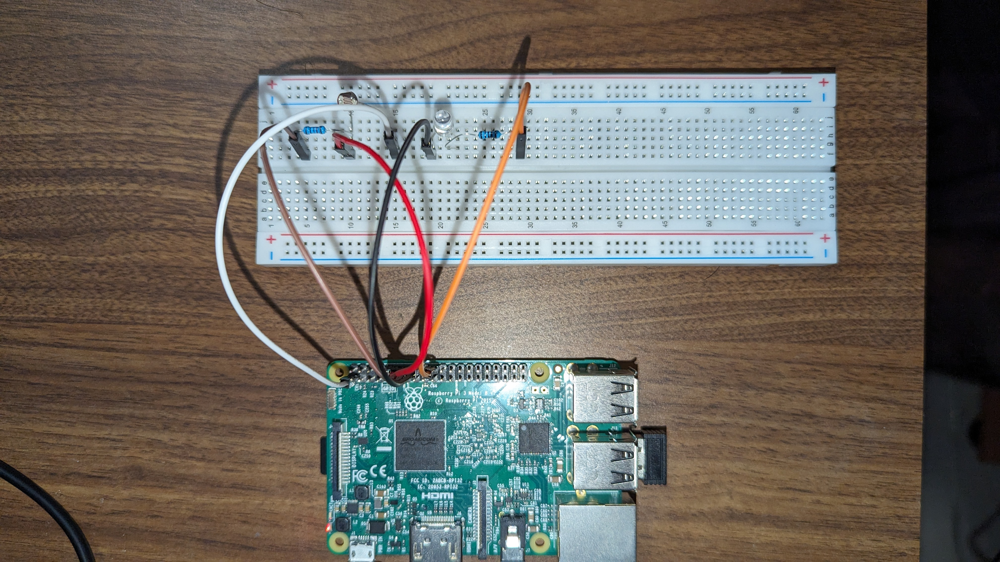

# SOFE4610-HomeAutomation

This project is aimed at providing a web-based interface for controlling and monitoring an LED light, with additional features such as auto mode based on a Light Dependent Resistor (LDR). The application is built using Django for the backend, and it includes a simple dashboard with JavaScript for interactive user controls.

## Table of Contents
- [File Structure](#file-structure)
- [File Description](#file-descriptions)
- [Wiring Schema](#wiring-schema)
- [Installation](#installation)
- [Running the Project](#running-the-project)
- [Screenshots](#screenshots)
- [Video Demo](#video-demo)

## File Structure

- [src](#src)
  - [automode](#automode)
    - [__init__.py](#automodeinitpy)
    - [settings.py](#automodesettingspy)
    - [urls.py](#automodeurlspy)
    - [wsgi.py](#automodewsgipy)
  - [lightcontrol](#lightcontrol)
    - [static](#lightcontrolstatic)
      - [css](#lightcontrolstaticcss)
        - [styles.css](#lightcontrolstaticcssstylescss)
      - [images](#lightcontrolstaticimages)
      - [js](#lightcontrolstaticjs)
        - [lightcontrol.js](#lightcontrolstaticjslightcontroljs)
    - [templates](#lightcontroltemplates)
      - [dashboard.html](#lightcontroltemplatesdashboardhtml)
    - [__init__.py](#lightcontrolinitpy)
    - [admin.py](#lightcontroladminpy)
    - [apps.py](#lightcontrolappspy)
    - [gpio_control.py](#lightcontrolgpio_controlpy)
    - [models.py](#lightcontrolmodelspy)
    - [tests.py](#lightcontroltestspy)
    - [urls.py](#lightcontrolurlspy)
    - [views.py](#lightcontrolviewspy)
  - [migrations](#migrations)
  - [db.sqlite3](#dbsqlite3)
  - [manage.py](#managepy)

## File Descriptions

### [Automode](src/automode/)

#### [automode/__init__.py](src/automode/__init__.py)

This file is a placeholder indicating that the `automode` directory should be treated as a Python package.

#### [automode/settings.py](src/automode/settings.py)

Configuration settings for the Django project. Includes database configuration, time zone settings, and more.

#### [automode/urls.py](src/automode/urls.py)

Defines the URL patterns for the Django project.

#### [automode/wsgi.py](src/automode/wsgi.py)

Configuration for the WSGI (Web Server Gateway Interface) to run the Django application.

### [lightcontrol](src/lightcontrol/)

#### [lightcontrol/static/css/styles.css](src/lightcontrol/static/css/styles.css)

CSS file for styling the web pages.

#### [lightcontrol/static/js/lightcontrol.js](src/lightcontrol/static/js/lightcontrol.js)

JavaScript file for client-side functionality, controlling interactions on the dashboard.

#### [lightcontrol/templates/dashboard.html](src/lightcontrol/templates/dashboard.html)

HTML template for the main dashboard page.

#### [lightcontrol/__init__.py](src/lightcontrol/__init__.py)

Similar to the `__init__.py` file in `automode`, this file indicates that `lightcontrol` is a Python package.

#### [lightcontrol/admin.py](src/lightcontrol/admin.py)

Configuration for Django's admin interface.

#### [lightcontrol/apps.py](src/lightcontrol/apps.py)

Configuration for the Django app.

#### [lightcontrol/gpio_control.py](src/lightcontrol/gpio_control.py)

Python script for interacting with GPIO (General Purpose Input/Output) pins on a Raspberry Pi. It includes functions for toggling the LED, reading the LDR, and controlling the LED based on LDR readings.

#### [lightcontrol/models.py](src/lightcontrol/models.py)

Defines the data models for the Django app, including the `Setting` model for storing LED and auto mode states.

#### [lightcontrol/tests.py](src/lightcontrol/tests.py)

Test cases for the Django app.

#### [lightcontrol/urls.py](src/lightcontrol/urls.py)

URL patterns specific to the `lightcontrol` app.

#### [lightcontrol/views.py](src/lightcontrol/views.py)

Defines the views (controller functions) for handling HTTP requests in the Django app.

### [migrations/](src/migrations)

Directory containing database migration files generated by Django.

### [db.sqlite3](src/db.sqlite3)

SQLite database file.

### [manage.py](src/manage.py)

Django management script for various tasks, such as running the development server and applying migrations.

## Wiring Schema

## Installation

## Running the Project

## Screenshots
This is what the dashroom looks like 

WHen the button is clicked, it toggles the other side and displays a green colour when the button is switched on

Screenshot of the dashboard with the server running

Here, the button is clicked and there is a request to the server to turn on the light

WHen the auto mode is turned on, you can see the various requests that the server is receiving as it detects outside light or not

More requests with the auto mode on

This is a photo display that the light does turn on

This is the wiring configuration when looking from the back

This is the top view of the wiring configuration

## Video Demo
