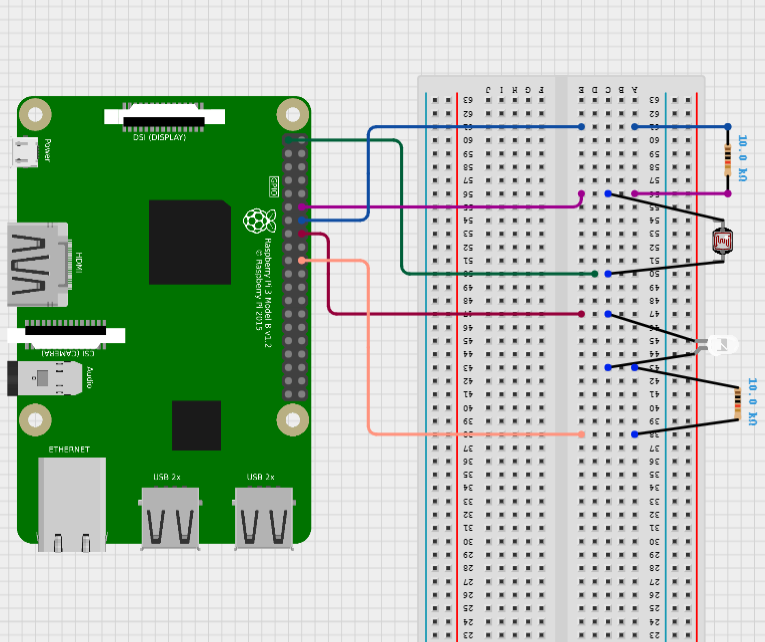

# SOFE4610-HomeAutomation

This project is aimed at providing a web-based interface for controlling and monitoring an LED light, with additional features such as auto mode based on a Light Dependent Resistor (LDR). The application is built using Django for the backend, and it includes a simple dashboard with JavaScript for interactive user controls.


## Table of Contents
- [File Structure](#file-structure)
- [File Description](#file-descriptions)
- [Wiring Schema](#wiring-schema)
- [Installation](#installation)
- [Running the Project](#running-the-project)
- [Screenshots](#screenshots)
- [Video Demo](#video-demo)

## File Structure

- [src](#src)
  - [automode](#automode)
    - [`__init__`.py](#automodeinitpy)
    - [settings.py](#automodesettingspy)
    - [urls.py](#automodeurlspy)
    - [wsgi.py](#automodewsgipy)
  - [lightcontrol](#lightcontrol)
    - [static](#lightcontrolstatic)
      - [css](#lightcontrolstaticcss)
        - [styles.css](#lightcontrolstaticcssstylescss)
      - [images](#lightcontrolstaticimages)
      - [js](#lightcontrolstaticjs)
        - [lightcontrol.js](#lightcontrolstaticjslightcontroljs)
    - [templates](#lightcontroltemplates)
      - [dashboard.html](#lightcontroltemplatesdashboardhtml)
    - [`__init__`.py](#lightcontrolinitpy)
    - [admin.py](#lightcontroladminpy)
    - [apps.py](#lightcontrolappspy)
    - [gpio_control.py](#lightcontrolgpio_controlpy)
    - [models.py](#lightcontrolmodelspy)
    - [tests.py](#lightcontroltestspy)
    - [urls.py](#lightcontrolurlspy)
    - [views.py](#lightcontrolviewspy)
  - [migrations](#migrations)
  - [db.sqlite3](#dbsqlite3)
  - [manage.py](#managepy)

## File Descriptions

### [automode](src/automode/)
<hr>

- #### [automode/`__init__`.py](src/automode/__init__.py)

    This file is a placeholder indicating that the `automode` directory should be treated as a Python package.

- #### [automode/settings.py](src/automode/settings.py)

    Configuration settings for the Django project. Includes database configuration, time zone settings, and more.

- #### [automode/urls.py](src/automode/urls.py)

    Defines the URL patterns for the Django project.

- #### [automode/wsgi.py](src/automode/wsgi.py)

    Configuration for the WSGI (Web Server Gateway Interface) to run the Django application.

### [lightcontrol](src/lightcontrol/)
<hr>

- #### [lightcontrol/static/css/styles.css](src/lightcontrol/static/css/styles.css)

    CSS file for styling the web pages.

- #### [lightcontrol/static/js/lightcontrol.js](src/lightcontrol/static/js/lightcontrol.js)

    This JavaScript file is responsible for controlling the interaction between your web page and the server, particularly for the light control functionality.

    **DOMContentLoaded Event:**

    The code begins by adding an event listener for the DOMContentLoaded event, which fires when the initial HTML document has been completely loaded and parsed.
    Inside this event listener, it initializes variables for various HTML elements and sets up a polling interval variable.

    **updateLedState Function:**

    Updates the LED state display and indicator on the page.
    It changes the text content, classes, and button styling based on the LED state.

    **updateAutoModeState Function:**

    Updates the Auto Mode state display and button text.
    Similar to updateLedState, it modifies text content, classes, and button styling based on the Auto Mode state.

    **pollLdrAndUpdateLed Function:**

    Makes a GET request to the server endpoint /lightcontrol/control_led_with_ldr/.
    Parses the JSON response and updates the LED state based on the response.
    
    **Event Listeners:**

    Adds event listeners for the toggle button (toggleButton) and auto mode button (autoModeButton). These listeners make GET requests to the server to toggle the LED or auto mode.

    The auto mode listener also starts polling at intervals when auto mode is turned on.

    **Initial State Check:**

    Performs initial checks of the LED state and Auto Mode state when the page loads.
    Makes GET requests to /lightcontrol/state/ and /lightcontrol/auto_mode_state/.

    **Window Unload Event:**

    Adds an event listener for the window's beforeunload event to clear the polling interval when the window is about to be unloaded.

- #### [lightcontrol/templates/dashboard.html](src/lightcontrol/templates/dashboard.html)

    HTML template for the main dashboard page.

- #### [lightcontrol/`__init__`.py](src/lightcontrol/__init__.py)

    Similar to the `__init__.py` file in `automode`, this file indicates that `lightcontrol` is a Python package.

- #### [lightcontrol/admin.py](src/lightcontrol/admin.py)

    Configuration for Django's admin interface.

- #### [lightcontrol/apps.py](src/lightcontrol/apps.py)

    Configuration for the Django app.

- #### [lightcontrol/gpio_control.py](src/lightcontrol/gpio_control.py)

    Python script for interacting with GPIO (General Purpose Input/Output) pins on a Raspberry Pi. It includes functions for toggling the LED, reading the LDR, and controlling the LED based on LDR readings.

    **GPIO Setup:**

    Sets up the GPIO channels (LED_PIN and LDR_PIN).
    
    **Functions:**

    **toggle_led()**: Toggles the LED state based on the current auto mode setting.

    **get_led_state()**: Gets the current LED state and updates the database if the hardware state differs from the database state.
    
    **read_ldr()**: Reads the digital value (0 or 1) from the LDR's D0 pin.
    
    **control_led_with_ldr()**: Controls the LED based on the LDR value when in auto mode.

- #### [lightcontrol/models.py](src/lightcontrol/models.py)

    Defines the data models for the Django app, including the `Setting` model for storing LED and auto mode states.

- #### [lightcontrol/tests.py](src/lightcontrol/tests.py)

    Test cases for the Django app.

- #### [lightcontrol/urls.py](src/lightcontrol/urls.py)

    URL patterns specific to the `lightcontrol` app.

- #### [lightcontrol/views.py](src/lightcontrol/views.py)

    Defines the views (controller functions) for handling HTTP requests in the Django app.

### [migrations/](src/migrations)

Directory containing database migration files generated by Django.

### [db.sqlite3](src/db.sqlite3)

SQLite database file.

### [manage.py](src/manage.py)

Django management script for various tasks, such as running the development server and applying migrations.


## Wiring Schema



This is the wiring configuration when looking from the back


This is the top view of the wiring configuration


## Installation
1. Clone the respository and navigate into the folder:
    ```
    git clone https://github.com/Darren-C26/SOFE4610-HomeAutomation.git
    cd SOFE4610-HomeAutomation/src
    ```
  

2. Run the database migrations:
    ```
    python3 manage.py makemigrations lightcontrol
    pythong manage.py migrate
    ```
 
## Running the Project

1. Start the server
    ```
    python manage.py runserver
    ```

2. Open the following address in a web browser
    ```
    http://<Raspberry_IP>:8000
    ```


## Screenshots
The following includes screen captures of the application.

<p align="center">
Dashboard Overview

</p>|
|-|

<p align="center">
Button Toggle

</p>|
|-|

<p align="center">
Server Display

</p>|
|-|

<p align="center">
Light On Request

</p>|
|-|

<p align="center">
AutoMode Turned On


</p>|
|-|

<p align="center">
LED Light on AutoMode

</p>|
|-|


## Video Demo

https://github.com/Darren-C26/SOFE4610-HomeAutomation/assets/47041816/5f94d2e4-21d2-440c-99a1-068f26056549

